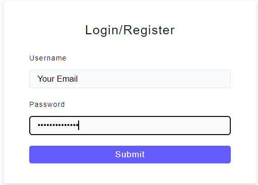

# Basic-JWT-Implemetation

This is the most basic implementation of JWT in nodejs 

## Initialization
First of all add the enviornment variable file and add your JWT secret variable as follows:
JWT_SECRET=YOURJWTSECERET

## How to Run:
To run this project first you'd need to install node modules first using the command:</br>
```npm install ```

Then, run the project using: </br>
``` npm start ``` </br>
and go to: 
``` localhost:3000``` 

### Generate JWT 
To generate the token send a POST request to: </br>
``` /api/v1/login ```
with username and password in request body like: 
``` 
{ "username":"youruser@gmail.com","password":"randomstring" } 
````



### Verify JWT 
To verify the token is valid, send a GET request to: </br> 
``` /api/v1/dasboard ```
with the authorization tokent from login request 


Tada! you get your lucky number!!!

